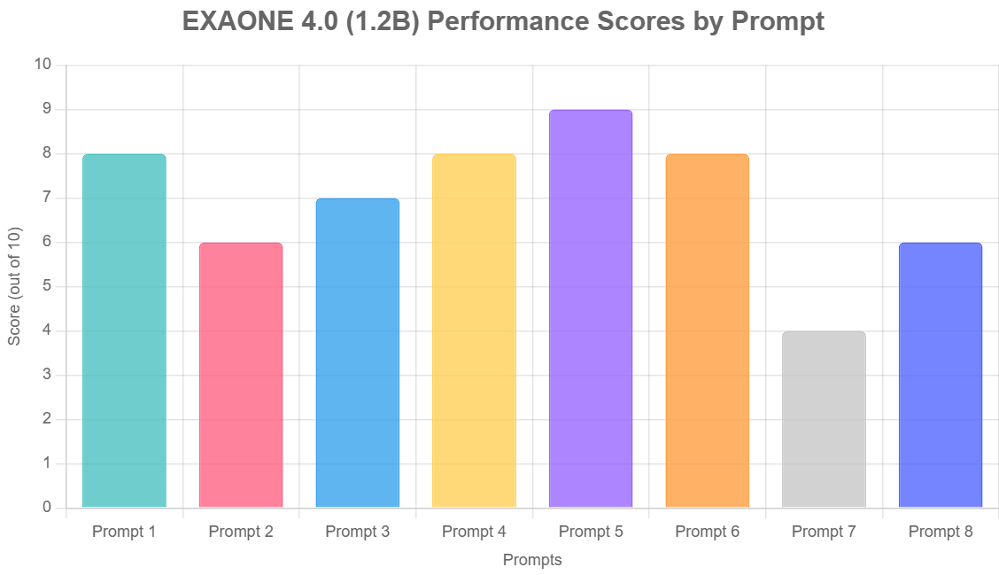

# Introduction
To evaluate the performance of the EXAONE 4.0 (1.2B) model on the provided response, I'll assess the responses using a comprehensive set of criteria: accuracy, completeness, clarity, relevance, language appropriateness, and latency. 

# Evaluation Criteria

- Accuracy: Is the response factually correct?
- Completeness: Does the response fully address the prompt?
- Clarity: Is the response clear and easy to understand?
- Relevance: Does the response stay on topic and avoid unnecessary information?
- Language Appropriateness: Is the language suitable for the audience and context (e.g., formal for factual/scientific, creative for stories, etc.)?
- Latency: Is the response time reasonable for the complexity of the prompt?
# EXAONE 4.0 (1.2B) model in non-reasoning mode
## 1. Prompt: "What is the capital of Canada?" (Factual)
**Response**: "The capital of Canada is Ottawa. It was established as the capital in 1857 and is located in northern Ontario. Ottawa is also the political and cultural center of Canada and hosts many national events, including the Canadian Parliament and the Parliament Hill celebrations."

- Accuracy: Correct but with a minor error. Ottawa is in southeastern Ontario, not northern Ontario.
- Completeness: Good. Provides the capital and additional context about its significance.
- Clarity: Excellent. The response is straightforward and easy to understand.
- Relevance: Good. The extra details about Ottawa’s role are relevant but slightly more than needed for a simple factual question.
- Language Appropriateness: Excellent. Formal and suitable for a factual query.
- Latency: 32.15 seconds. Reasonable for a factual question, though slightly high for a simple query in non-reasoning mode.
- Score: 8/10 (deduction for the geographic error and slightly high latency).

## 2. Prompt: "If a car travels at 60 km/h for 2.5 hours, how far did it go?" (Reasoning)
**Response**: Uses the formula Distance = Speed × Time, calculates 60 × 2.5 = 150 km, and presents the answer as 150 km.

- Accuracy: Excellent. The calculation is correct (60 × 2.5 = 150 km).
- Completeness: Good. Provides the final answer but includes reasoning steps, which contradicts the non-reasoning mode requirement.
- Clarity: Excellent. The answer is clear, though the reasoning steps make it longer than necessary.
- Relevance: Moderate. The reasoning steps are irrelevant for non-reasoning mode.
- Language Appropriateness: Excellent. The language is precise and mathematical.
- Latency: 121.86 seconds. Excessive for a simple calculation in non-reasoning mode, where a direct answer (150 km) should suffice.
- Score: 6/10 (deduction for including reasoning steps and high latency).

## 3. Prompt: "Why is the sky blue?" (Scientific)
**Response**: Explains Rayleigh scattering, sunlight composition, scattering mechanism, why violet isn’t dominant, and differences at sunrise/sunset. Offers additional details if desired.

- Accuracy: Excellent. The explanation of Rayleigh scattering and why the sky appears blue is correct.
- Completeness: Excellent. Covers the scientific mechanism comprehensively.
- Clarity: Good. The explanation is clear but slightly technical for a general audience.
- Relevance: Moderate. The additional offer for details and fun fact are extraneous in non-reasoning mode.
- Language Appropriateness: Good. Scientific tone is appropriate but could be simpler for non-expert readers.
- Latency: 232.8 seconds. Very high for a scientific explanation, especially in non-reasoning mode where a concise answer is expected.
- Score: 7/10 (deduction for verbosity, technicality, and high latency).

## 4. Prompt: "Write a short story about a dragon who learns to cook." (Creative)
**Response**: A concise story about Thoran the Dragon finding a skillet, learning to cook, and gaining appreciation for his culinary skills.

- Accuracy: N/A (creative prompt; no factual accuracy required).
- Completeness: Good. The story is short, engaging, and addresses the prompt, though it’s brief.
- Clarity: Excellent. The narrative is clear and easy to follow.
- Relevance: Excellent. Sticks to the prompt without extraneous details.
- Language Appropriateness: Excellent. Creative and vivid, fitting for a story.
- Latency: 125.22 seconds. Reasonable for a creative task but slightly high for non-reasoning mode.
- Score: 8/10 (deduction for brevity and latency).

## 5. Prompt: "Explain gravity in Korean." (Multilingual)
**Response**: Explains gravity as a force between masses, referencing Newton’s law and the moon’s orbit, in Korean.

- Accuracy: Excellent. The explanation is correct and scientifically accurate.
- Completeness: Good. Covers the basics of gravity but could elaborate slightly more for clarity.
- Clarity: Excellent. Simple and clear in Korean.
- Relevance: Excellent. Directly addresses the prompt without extra information.
- Language Appropriateness: Excellent. Uses natural Korean suitable for a general audience.
- Latency: 45.67 seconds. Reasonable for a multilingual scientific explanation.
- Score: 9/10 (slight deduction for brevity).

## 6. Prompt: "List 3 benefits of regular exercise." (Instruction)
**Response**: Lists improved cardiovascular health, weight management, and mental health boost, with an offer for more details.

- Accuracy: Excellent. All listed benefits are factually correct.
- Completeness: Good. Provides three benefits but includes an unnecessary offer for more details.
- Clarity: Excellent. Clear and concise list format.
- Relevance: Good. The offer for additional details is extraneous in non-reasoning mode.
- Language Appropriateness: Excellent. Simple and appropriate for an instructional prompt.
- Latency: 54.84 seconds. Slightly high for a simple list in non-reasoning mode.
- Score: 8/10 (deduction for extraneous offer and latency).

## 7. Prompt: "Translate 'I love you' into French." (Multilingual)
**Response**: Provides "Je t'aime" (male) and "Je vous aime" (female), plus less common phrases like "Je vous prie d'amour" and "Je vous adores."

- Accuracy: Incorrect. "Je t'aime" is correct, but "Je vous aime" is not gender-specific (it’s formal or plural). "Je vous prie d'amour" is not a standard translation, and "Je vous adores" is grammatically incorrect ("adores" should be "adore").
- Completeness: Moderate. Includes the correct translation but adds incorrect and unnecessary variations.
- Clarity: Moderate. The response is confusing due to incorrect gender distinctions and non-standard phrases.
- Relevance: Poor. Extraneous translations detract from the main answer.
- Language Appropriateness: Moderate. The French is partially correct but includes errors.
- Latency: 76.41 seconds. High for a simple translation.
- Score: 4/10 (deduction for inaccuracies, irrelevance, and latency).

## 8. Prompt: "Is 3.12 larger than 3.9?" (Comparison)
**Response**: Compares 3.12 and 3.9, concluding 3.12 is not larger than 3.9.

- Accuracy: Excellent. The comparison is correct (3.12 < 3.9).
- Completeness: Moderate. Includes reasoning steps, which are unnecessary in non-reasoning mode.
- Clarity: Good. The answer is clear but longer than needed.
- Relevance: Moderate. Reasoning steps are irrelevant for non-reasoning mode.
- Language Appropriateness: Excellent. Precise and mathematical.
- Latency: 154.75 seconds. Excessive for a simple comparison.
- Score: 6/10 (deduction for reasoning steps and high latency).

## Overall Evaluation

- Strengths:
  - High accuracy in most responses (except for minor errors in prompts 1 and 7).
  - Clear and appropriate language in most cases, especially for factual, creative, and instructional prompts.
  - Multilingual capability is strong, particularly in Korean (prompt 5).

- Weaknesses:
  - Non-reasoning mode violation: Several responses (prompts 2, 3, 8) include reasoning steps or extraneous details, which contradicts the non-reasoning mode requirement for direct answers.
  - Latency: Latencies are generally high (32–232 seconds), especially for simple tasks like factual questions, translations, and comparisons, which is suboptimal for non-reasoning mode.
  - Errors in multilingual translation: Prompt 7 contains significant inaccuracies in French translations.
  - Over-elaboration: Some responses (e.g., prompts 3, 6, 7) include unnecessary details or offers for more information, reducing relevance in non-reasoning mode.

- Average Score: (8 + 6 + 7 + 8 + 9 + 8 + 4 + 6) / 8 = 7/10
- Latency Average: (32.15 + 121.86 + 232.8 + 125.22 + 45.67 + 54.84 + 76.41 + 154.75) / 8 ≈ 105.46 seconds

  

# EXAONE 4.0 (1.2B) model in reasoning mode

## 1. Prompt: "What is the capital of Canada?" (Factual)
**Response**: States Ottawa as the capital, with details about its location, founding, and role as a political/cultural center. Reasoning considers user intent and context.

- Accuracy: Incorrect. Ottawa is in southeastern Ontario, not on the "northbank of the Canadian Shield." It was chosen as the capital in 1857, not 1774 (1774 predates Canada’s formation; Ottawa was founded as Bytown in 1826). The 1971 date in the reasoning is also incorrect.
- Completeness: Good. Provides the capital and relevant context, with reasoning exploring user intent (e.g., student or traveler needs).
- Clarity: Excellent. The response is clear, and the reasoning is structured, though slightly speculative about user intent.
- Relevance: Good. The reasoning adds context but includes unnecessary speculation about user motives.
- Language Appropriateness: Excellent. Formal tone suits a factual query.
- Latency: 138.05 seconds. High for a simple factual question, even with reasoning.
- Score: 6/10 (deduction for factual errors and high latency).

## 2. Prompt: "If a car travels at 60 km/h for 2.5 hours, how far did it go?" (Reasoning)
**Response**: Uses the formula Distance = Speed × Time, calculates 60 × 2.5 = 150 km, with reasoning steps explaining the process and double-checking.

- Accuracy: Excellent. The calculation (150 km) is correct.
- Completeness: Excellent. The response answers the prompt, and reasoning steps thoroughly explain the process, including unit consistency and verification.
- Clarity: Excellent. The reasoning is clear, methodical, and easy to follow.
- Relevance: Excellent. The reasoning focuses on solving the problem without tangents.
- Language Appropriateness: Excellent. Precise and mathematical, fitting for a reasoning task.
- Latency: 274.66 seconds. Excessive for a straightforward calculation, even with reasoning.
- Score: 8/10 (deduction for high latency).

## 3. Prompt: "Why is the sky blue?" (Scientific)
**Response**: Explains Rayleigh scattering, sunlight composition, and wavelength scattering, with reasoning considering user level and misconceptions. The response cuts off mid-sentence.

- Accuracy: Excellent (based on provided text). The explanation of Rayleigh scattering is correct, though incomplete due to truncation.
- Completeness: Poor. The response is cut off, missing the full explanation (e.g., why violet isn’t dominant, as hinted in reasoning).
- Clarity: Good. The provided portion is clear, but truncation reduces overall clarity. Reasoning is structured but slightly verbose.
- Relevance: Good. The reasoning addresses user needs and misconceptions, though it speculates about user intent (e.g., environmental science interest).
- Language Appropriateness: Good. Scientific tone is appropriate but slightly technical for a general audience.
- Latency: 269.04 seconds. Very high for an incomplete response, even with reasoning.
- Score: 5/10 (deduction for incompleteness and high latency).

## 4. Prompt: "Write a short story about a dragon who learns to cook." (Creative)
**Response**: A story about Leo the dragon discovering a pot and learning to cook, with reasoning planning the narrative’s tone, setting, and emotional arc. The response cuts off mid-narrative.

- Accuracy: N/A (creative prompt; no factual accuracy required).
- Completeness: Poor. The story is incomplete due to truncation, ending abruptly without resolution.
- Clarity: Good. The provided portion is vivid and engaging, with clear reasoning about tone and sensory details.
- Relevance: Excellent. The reasoning and story focus on the prompt, with thoughtful planning for a transformative arc.
- Language Appropriateness: Excellent. Creative, vivid language suits a story.
- Latency: 271.41 seconds. High for an incomplete story, even with reasoning.
- Score: 5/10 (deduction for incompleteness and high latency).

## 5. Prompt: "Explain gravity in Korean." (Multilingual)
**Response**: Explains gravity as a force, referencing Newton’s law and Einstein’s theory, with examples like tides. Reasoning plans for natural Korean and real-life examples. The response cuts off.

- Accuracy: Excellent (based on provided text). The explanation is correct, though incomplete.
- Completeness: Poor. The response is truncated, missing the full explanation (e.g., continuation of stellar interactions).
- Clarity: Good. The provided portion is clear and natural in Korean, with reasoning ensuring accessibility.
- Relevance: Good. The reasoning focuses on user needs (e.g., student context) but slightly overcomplicates with Einstein’s theory.
- Language Appropriateness: Excellent. Natural Korean with appropriate scientific terms.
- Latency: 269.13 seconds. Excessive for an incomplete response.
- Score: 5/10 (deduction for incompleteness and high latency).

## 6. Prompt: "List 3 benefits of regular exercise." (Instruction)
**Response**: Lists cardiovascular health, weight management, and mental health benefits, with reasoning considering user context and tone.

- Accuracy: Excellent. All benefits are factually correct.
- Completeness: Excellent. Provides three benefits with clear descriptions, and reasoning adds value by considering user needs.
- Clarity: Excellent. The list is concise, and reasoning is structured and relevant.
- Relevance: Good. The reasoning is relevant but slightly speculative about user motives (e.g., stress relief).
- Language Appropriateness: Excellent. Neutral yet approachable tone suits an instructional prompt.
- Latency: 167.09 seconds. High for a simple list, even with reasoning.
- Score: 8/10 (deduction for high latency and minor speculation).

## 7. Prompt: "Translate 'I love you' into French." (Multilingual)
**Response**: Provides "Je t'aime" and "Je vous amis" (incorrect), with reasoning discussing formality and tone.

- Accuracy: Incorrect. "Je t'aime" is correct, but "Je vous amis" is wrong ("amis" is "friends"; correct is "Je vous aime," which is formal/plural, not "warmer"). No gender distinction exists in French for this phrase.
- Completeness: Moderate. Includes the correct translation but adds an incorrect one, with reasoning overcomplicating formality.
- Clarity: Moderate. The response is confusing due to the incorrect translation and misleading formality notes.
- Relevance: Poor. The reasoning and extra translation add unnecessary complexity.
- Language Appropriateness: Moderate. The French is partially correct, but errors undermine quality.
- Latency: 168.96 seconds. Excessive for a simple translation.
- Score: 4/10 (deduction for inaccuracies, irrelevance, and high latency).

## 8. Prompt: "Is 3.12 larger than 3.9?" (Comparison)
**Response**: Concludes 3.12 is less than 3.9, with reasoning comparing decimals and verifying with subtraction. The response cuts off mid-calculation.

- Accuracy: Excellent (based on provided text). The conclusion (3.12 < 3.9) is correct.
- Completeness: Poor. The response is truncated, missing the final answer statement.
- Clarity: Good. The reasoning is clear and methodical, though truncation affects completeness.
- Relevance: Excellent. The reasoning focuses on the comparison without tangents.
- Language Appropriateness: Excellent. Precise and mathematical.
- Latency: 271.06 seconds. Excessive for an incomplete response.
- Score: 5/10 (deduction for incompleteness and high latency).

## Overall Evaluation

- Strengths:

  - High accuracy in most responses (except prompts 1 and 7).
  - Reasoning steps are generally well-structured and add value by explaining thought processes, especially for reasoning and scientific prompts.
  - Strong language appropriateness in creative, instructional, and multilingual (Korean) responses.

- Weaknesses:

  - Truncation Issues: Prompts 3, 4, 5, and 8 are incomplete, significantly reducing completeness and overall quality.
  - Factual Errors: Prompt 1 has multiple inaccuracies about Ottawa’s location and history, and Prompt 7 has incorrect French translations.
  - High Latency: Latencies (138–274 seconds) are excessively high, even for reasoning mode, where additional processing is expected.
  - Overcomplication in Reasoning: Some reasoning steps (e.g., prompts 1, 7) include speculative user intent or unnecessary complexity, reducing relevance.
  - Multilingual Weakness: The French translation in Prompt 7 is notably weak, with grammatical and contextual errors.

- Average Score: (6 + 8 + 5 + 5 + 5 + 8 + 4 + 5) / 8 = 5.75/10
- Latency Average: (138.05 + 274.66 + 269.04 + 271.41 + 269.13 + 167.09 + 168.96 + 271.06) / 8 ≈ 229.93 seconds

  

# Comparison

- Non-Reasoning Mode (Previous Evaluation):

  - Average Score: 7/10
  - Average Latency: 105.46 seconds

- Reasoning Mode:

  - Average Score: 5.75/10 (lower due to truncation and errors)
  - Average Latency: 229.93 seconds (higher due to reasoning steps)

- Analysis: Non-reasoning mode performed better overall due to fewer errors and complete responses. Reasoning mode’s truncation issues and higher latency suggest technical or processing limitations, despite the potential for deeper insights.
