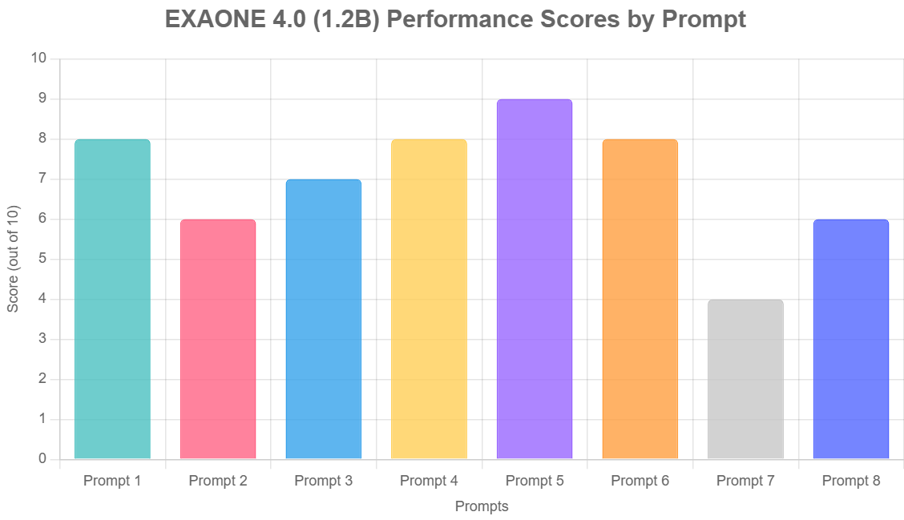
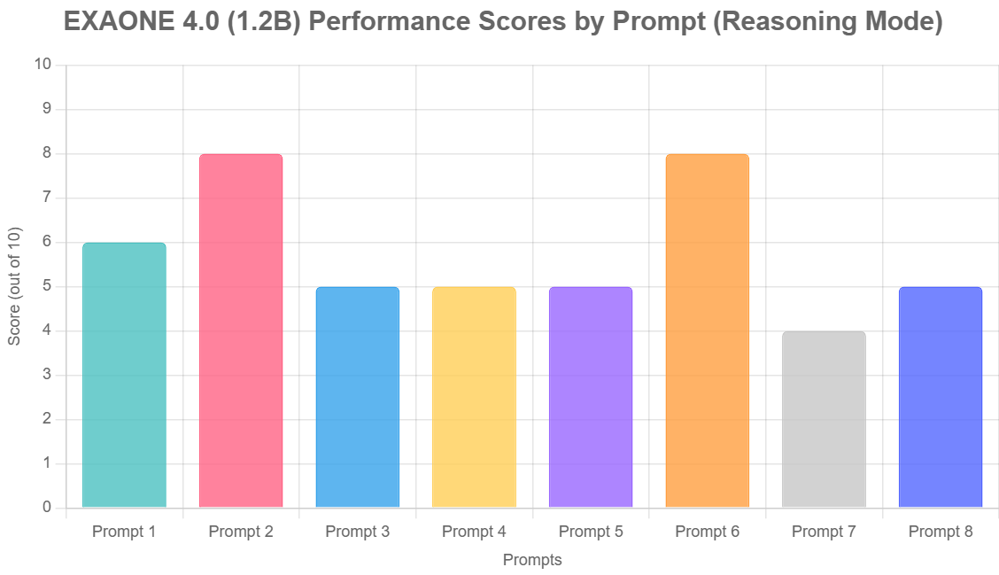

# 소개
EXAONE 4.0 (1.2B) 모델의 성능을 제공된 응답을 통해 평가하기 위해, 정확성, 완전성, 명확성, 관련성, 언어 적합성, 지연 시간이라는 포괄적인 기준을 사용해 응답을 평가하겠습니다.

# 평가 기준

- **정확성**: 응답이 사실적으로 정확한가?
- **완전성**: 응답이 프롬프트를 완전히 다루는가?
- **명확성**: 응답이 명확하고 이해하기 쉬운가?
- **관련성**: 응답이 주제에 충실하며 불필요한 정보를 피하는가?
- **언어 적합성**: 언어가 청중에 적합하고 맥락에 맞는가 (예: 사실/과학 질문에는 공식적, 이야기에는 창의적)?
- **지연 시간**: 프롬프트의 복잡성에 비해 응답 시간이 합리적인가?

# EXAONE 4.0 (1.2B) 모델 (비추론 모드)
## 1. 프롬프트: "캐나다의 수도는 무엇인가?" (사실)
**응답**: "캐나다의 수도는 오타와입니다. 1857년에 수도로 지정되었으며 북부 온타리오에 위치해 있습니다. 오타와는 캐나다의 정치 및 문화 중심지로, 캐나다 의회와 의회 언덕 행사를 포함한 많은 국가 행사를 주최합니다."

- **정확성**: 정확하지만 약간의 오류가 있음. 오타와는 북부 온타리오가 아닌 남동부 온타리오에 위치함.
- **완전성**: 좋음. 수도와 그 중요성에 대한 추가 맥락 제공.
- **명확성**: 우수함. 응답이 간단하고 이해하기 쉬움.
- **관련성**: 좋음. 오타와의 역할에 대한 추가 세부사항은 관련성이 있지만 간단한 사실 질문에는 약간 과도함.
- **언어 적합성**: 우수함. 사실 질문에 적합한 공식적 톤.
- **지연 시간**: 32.15초. 사실 질문에 대해 합리적이지만 비추론 모드의 단순 질문에는 약간 높음.
- **점수**: 8/10 (지리적 오류와 약간 높은 지연 시간으로 인해 감점).

## 2. 프롬프트: "차가 60km/h로 2.5시간 동안 이동하면 얼마나 멀리 갔는가?" (추론)
**응답**: 거리 = 속도 × 시간 공식을 사용해 60 × 2.5 = 150km를 계산하고 답을 150km로 제시.

- **정확성**: 우수함. 계산이 정확함 (60 × 2.5 = 150km).
- **완전성**: 좋음. 최종 답변을 제공하지만 비추론 모드 요구사항과 달리 추론 단계를 포함함.
- **명확성**: 우수함. 답변은 명확하지만 추론 단계로 인해 필요 이상으로 길어짐.
- **관련성**: 보통. 비추론 모드에서는 추론 단계가 불필요함.
- **언어 적합성**: 우수함. 언어가 정확하고 수학적임.
- **지연 시간**: 121.86초. 비추론 모드의 단순 계산에 비해 과도함.
- **점수**: 6/10 (추론 단계 포함과 높은 지연 시간으로 감점).

## 3. 프롬프트: "하늘이 왜 파란가?" (과학)
**응답**: 레일리 산란, 태양광 구성, 산란 메커니즘, 보라색이 지배적이지 않은 이유, 일출/일몰 차이를 설명. 추가 세부사항 제공 제안 포함.

- **정확성**: 우수함. 하늘이 파란 이유와 레일리 산란 설명이 정확함.
- **완전성**: 우수함. 과학적 메커니즘을 포괄적으로 다룸.
- **명확성**: 좋음. 설명은 명확하지만 일반 청중에게 약간 기술적임.
- **관련성**: 보통. 비추론 모드에서 추가 세부사항 제안과 재미있는 사실은 불필요함.
- **언어 적합성**: 좋음. 과학적 톤은 적절하지만 비전문가에게는 더 단순할 수 있음.
- **지연 시간**: 232.8초. 과학적 설명, 특히 비추론 모드에서 간결한 답변이 기대되는 경우 매우 높음.
- **점수**: 7/10 (장황함, 기술적 복잡성, 높은 지연 시간으로 감점).

## 4. 프롬프트: "요리를 배우는 용에 대한 짧은 이야기를 써라." (창의)
**응답**: 토란이라는 용이 프라이팬을 발견하고 요리를 배우며 요리 기술에 대한 인정을 받는 간결한 이야기.

- **정확성**: 해당 없음 (창의적 프롬프트; 사실적 정확성 불필요).
- **완전성**: 좋음. 이야기는 짧고 흥미로우며 프롬프트를 다루지만 간략함.
- **명확성**: 우수함. 내러티브가 명확하고 따라가기 쉬움.
- **관련성**: 우수함. 불필요한 세부사항 없이 프롬프트에 충실.
- **언어 적합성**: 우수함. 창의적이고 생생한, 이야기에 적합한 언어.
- **지연 시간**: 125.22초. 창의적 작업에 대해 합리적이지만 비추론 모드에서는 약간 높음.
- **점수**: 8/10 (간략함과 지연 시간으로 감점).

## 5. 프롬프트: "중력을 한국어로 설명하라." (다국어)
**응답**: 중력을 질량 간의 힘으로 설명하며, 뉴턴의 법칙과 달의 궤도를 언급, 한국어로 작성.

- **정확성**: 우수함. 설명이 정확하고 과학적으로 맞음.
- **완전성**: 좋음. 중력의 기본을 다루지만 명확성을 위해 약간 더 설명할 수 있음.
- **명확성**: 우수함. 한국어로 간단하고 명확함.
- **관련성**: 우수함. 추가 정보 없이 프롬프트에 직접 응답.
- **언어 적합성**: 우수함. 일반 청중에 적합한 자연스러운 한국어.
- **지연 시간**: 45.67초. 다국어 과학 설명에 대해 합리적.
- **점수**: 9/10 (간략함으로 약간 감점).

## 6. 프롬프트: "규칙적인 운동의 3가지 이점을 나열하라." (지시)
**응답**: 심혈관 건강 개선, 체중 관리, 정신 건강 증진을 나열하며 추가 세부사항 제안 포함.

- **정확성**: 우수함. 나열된 모든 이점이 사실적으로 정확함.
- **완전성**: 좋음. 세 가지 이점을 제공하지만 추가 세부사항 제안은 불필요함.
- **명확성**: 우수함. 명확하고 간결한 목록 형식.
- **관련성**: 좋음. 비추론 모드에서 추가 세부사항 제안은 불필요함.
- **언어 적합성**: 우수함. 지시 프롬프트에 적합한 간단한 언어.
- **지연 시간**: 54.84초. 비추론 모드의 단순 목록에 비해 약간 높음.
- **점수**: 8/10 (불필요한 제안과 지연 시간으로 감점).

## 7. 프롬프트: "'I love you'를 프랑스어로 번역하라." (다국어)
**응답**: "Je t'aime" (남성)과 "Je vous aime" (여성), 그리고 "Je vous prie d'amour" 및 "Je vous adores"와 같은 덜 일반적인 표현 제공.

- **정확성**: 부정확. "Je t'aime"은 정확하지만, "Je vous aime"은 성별과 무관 (공식적이거나 복수). "Je vous prie d'amour"는 표준 번역이 아니며, "Je vous adores"는 문법적으로 틀림 ("adores"는 "adore"로 수정해야 함).
- **완전성**: 보통. 올바른 번역을 포함하지만 부정확하고 불필요한 변형 추가.
- **명확성**: 보통. 잘못된 성별 구분과 비표준 표현으로 인해 혼란스러움.
- **관련성**: 낮음. 불필요한 번역이 주요 답변의 가치를 떨어뜨림.
- **언어 적합성**: 보통. 프랑스어가 부분적으로 정확하지만 오류가 품질을 저하시킴.
- **지연 시간**: 76.41초. 단순 번역에 비해 높음.
- **점수**: 4/10 (부정확성, 관련성 부족, 지연 시간으로 감점).

## 8. 프롬프트: "3.12가 3.9보다 큰가?" (비교)
**응답**: 3.12와 3.9를 비교하여 3.12가 3.9보다 크지 않다고 결론.

- **정확성**: 우수함. 비교가 정확함 (3.12 < 3.9).
- **완전성**: 보통. 비추론 모드에서 불필요한 추론 단계 포함.
- **명확성**: 좋음. 답변은 명확하지만 필요 이상으로 길어짐.
- **관련성**: 보통. 비추론 모드에서 추론 단계는 불필요함.
- **언어 적합성**: 우수함. 정확하고 수학적.
- **지연 시간**: 154.75초. 단순 비교에 비해 과도함.
- **점수**: 6/10 (추론 단계와 높은 지연 시간으로 감점).

## 전체 평가

- **강점**:
  - 대부분의 응답에서 높은 정확성 (프롬프트 1과 7의 사소한 오류 제외).
  - 사실, 창의, 지시 프롬프트에서 명확하고 적절한 언어.
  - 특히 한국어 (프롬프트 5)에서 강력한 다국어 능력.

- **약점**:
  - 비추론 모드 위반: 여러 응답 (프롬프트 2, 3, 8)이 직접 답변을 요구하는 비추론 모드 요구사항과 달리 추론 단계 또는 불필요한 세부사항 포함.
  - 지연 시간: 지연 시간이 전반적으로 높음 (32~232초), 특히 비추론 모드의 단순 작업 (사실 질문, 번역, 비교)에 비해 최적이지 않음.
  - 다국어 번역 오류: 프롬프트 7에서 프랑스어 번역에 심각한 부정확성 포함.
  - 과도한 설명: 일부 응답 (예: 프롬프트 3, 6, 7)이 불필요한 세부사항이나 추가 정보 제안을 포함하여 비추론 모드에서 관련성을 감소시킴.

- **평균 점수**: (8 + 6 + 7 + 8 + 9 + 8 + 4 + 6) / 8 = 7/10
- **평균 지연 시간**: (32.15 + 121.86 + 232.8 + 125.22 + 45.67 + 54.84 + 76.41 + 154.75) / 8 ≈ 105.46초

  

# EXAONE 4.0 (1.2B) 모델 (추론 모드)

## 1. 프롬프트: "캐나다의 수도는 무엇인가?" (사실)
**응답**: 오타와를 수도로 명시하며, 위치, 설립, 정치/문화 중심지로서의 역할에 대한 세부사항 제공. 추론은 사용자 의도와 맥락을 고려.

- **정확성**: 부정확. 오타와는 "캐나다 방패의 북쪽"이 아닌 남동부 온타리오에 위치. 1774년이 아닌 1857년에 수도로 선택됨 (1774년은 캐나다 형성 이전; 오타와는 1826년에 바이터운으로 설립됨). 추론의 1971년도 부정확.
- **완전성**: 좋음. 수도와 관련 맥락을 제공하며, 추론은 사용자 의도 (예: 학생 또는 여행자 필요)를 탐구.
- **명확성**: 우수함. 응답은 명확하고 추론은 체계적이지만 사용자 의도에 대한 추측이 약간 포함됨.
- **관련성**: 좋음. 추론은 맥락을 추가하지만 사용자 동기에 대한 불필요한 추측 포함.
- **언어 적합성**: 우수함. 사실 질문에 적합한 공식적 톤.
- **지연 시간**: 138.05초. 추론 포함이라도 단순 사실 질문에 비해 높음.
- **점수**: 6/10 (사실 오류와 높은 지연 시간으로 감점).

## 2. 프롬프트: "차가 60km/h로 2.5시간 동안 이동하면 얼마나 멀리 갔는가?" (추론)
**응답**: 거리 = 속도 × 시간 공식을 사용해 60 × 2.5 = 150km를 계산하며, 추론 단계에서 프로세스를 설명하고 이중 확인.

- **정확성**: 우수함. 계산 (150km)이 정확함.
- **완전성**: 우수함. 프롬프트를 답변하며 추론 단계는 단위 일관성과 검증을 포함해 프로세스를 철저히 설명.
- **명확성**: 우수함. 추론이 명확하고 체계적이며 따라가기 쉬움.
- **관련성**: 우수함. 문제 해결에 초점을 맞춘 추론은 불필요한 내용 없이 진행.
- **언어 적합성**: 우수함. 추론 작업에 적합한 정확하고 수학적 언어.
- **지연 시간**: 274.66초. 단순 계산에 비해, 추론 포함이라도 과도함.
- **점수**: 8/10 (높은 지연 시간으로 감점).

## 3. 프롬프트: "하늘이 왜 파란가?" (과학)
**응답**: 레일리 산란, 태양광 구성, 파장 산란을 설명하며, 사용자 수준과 오해를 고려한 추론 포함. 응답이 문장 중간에서 끊김.

- **정확성**: 우수함 (제공된 텍스트 기준). 레일리 산란 설명은 정확하지만, 중단으로 인해 불완전.
- **완전성**: 낮음. 중단으로 인해 완전한 설명 (예: 보라색이 지배적이지 않은 이유)이 누락됨.
- **명확성**: 좋음. 제공된 부분은 명확하지만 중단으로 전체 명확성이 저하. 추론은 체계적이지만 약간 장황함.
- **관련성**: 좋음. 추론은 사용자 필요와 오해를 다루지만, 환경 과학 관심에 대한 추측이 포함됨.
- **언어 적합성**: 좋음. 과학적 톤은 적절하지만 일반 청중에게 약간 기술적임.
- **지연 시간**: 269.04초. 불완전한 응답에 비해 매우 높음.
- **점수**: 5/10 (불완전성과 높은 지연 시간으로 감점).

## 4. 프롬프트: "요리를 배우는 용에 대한 짧은 이야기를 써라." (창의)
**응답**: 레오라는 용이 냄비를 발견하고 요리를 배우는 이야기로, 추론은 내러티브의 톤, 설정, 감정적 아크를 계획. 응답이 내러티브 중간에서 끊김.

- **정확성**: 해당 없음 (창의적 프롬프트; 사실적 정확성 불필요).
- **완전성**: 낮음. 중단으로 인해 이야기가 미완성이며 결론이 없음.
- **명확성**: 좋음. 제공된 부분은 생생하고 매력적이지만, 추론은 톤과 감각적 세부사항에 대해 명확.
- **관련성**: 우수함. 추론과 이야기는 프롬프트에 초점을 맞추며, 변형 아크에 대한 사려 깊은 계획 포함.
- **언어 적합성**: 우수함. 이야기에 적합한 창의적이고 생생한 언어.
- **지연 시간**: 271.41초. 불완전한 이야기에 비해 높음.
- **점수**: 5/10 (불완전성과 높은 지연 시간으로 감점).

## 5. 프롬프트: "중력을 한국어로 설명하라." (다국어)
**응답**: 중력을 힘으로 설명하며, 뉴턴의 법칙과 아인슈타인의 이론, 조수 같은 예시를 언급. 추론은 자연스러운 한국어와 실생활 예시를 계획. 응답이 중단됨.

- **정확성**: 우수함 (제공된 텍스트 기준). 설명은 정확하지만 불완전.
- **완전성**: 낮음. 중단으로 인해 전체 설명 (예: 별 간 상호작용의 연속)이 누락됨.
- **명확성**: 좋음. 제공된 부분은 명확하고 자연스러운 한국어로 작성되며, 추론은 접근성을 보장.
- **관련성**: 좋음. 추론은 사용자 필요 (예: 학생 맥락)에 초점을 맞추지만 아인슈타인 이론으로 약간 복잡해짐.
- **언어 적합성**: 우수함. 적절한 과학 용어와 함께 자연스러운 한국어.
- **지연 시간**: 269.13초. 불완전한 응답에 비해 과도함.
- **점수**: 5/10 (불완전성과 높은 지연 시간으로 감점).

## 6. 프롬프트: "규칙적인 운동의 3가지 이점을 나열하라." (지시)
**응답**: 심혈관 건강, 체중 관리, 정신 건강 이점을 나열하며, 사용자 맥락과 톤을 고려한 추론 포함.

- **정확성**: 우수함. 모든 이점이 사실적으로 정확함.
- **완전성**: 우수함. 세 가지 이점을 명확히 설명하며, 추론은 사용자 필요를 고려해 가치를 더함.
- **명확성**: 우수함. 목록은 간결하며, 추론은 체계적이고 관련성 있음.
- **관련성**: 좋음. 추론은 관련성이 있지만 사용자 동기 (예: 스트레스 해소)에 대한 약간의 추측 포함.
- **언어 적합성**: 우수함. 지시 프롬프트에 적합한 중립적이면서 접근 가능한 톤.
- **지연 시간**: 167.09초. 단순 목록에 비해, 추론 포함이라도 높음.
- **점수**: 8/10 (높은 지연 시간과 사소한 추측으로 감점).

## 7. 프롬프트: "'I love you'를 프랑스어로 번역하라." (다국어)
**응답**: "Je t'aime"과 "Je vous amis" (부정확)를 제공하며, 공식성과 톤을 논의하는 추론 포함.

- **정확성**: 부정확. "Je t'aime"은 정확하지만, "Je vous amis"는 틀림 ("amis"는 "친구"; 올바른 표현은 공식적/복수인 "Je vous aime"). 프랑스어에는 이 문구에 성별 구분이 없음.
- **완전성**: 보통. 올바른 번역을 포함하지만 부정확한 번역을 추가하며, 추론은 공식성을 과도하게 복잡하게 만듦.
- **명확성**: 보통. 잘못된 번역과 오해를 일으키는 공식성 논의로 인해 혼란스러움.
- **관련성**: 낮음. 추론과 추가 번역이 불필요한 복잡성을 추가.
- **언어 적합성**: 보통. 프랑스어가 부분적으로 정확하지만 오류가 품질을 저하시킴.
- **지연 시간**: 168.96초. 단순 번역에 비해 과도함.
- **점수**: 4/10 (부정확성, 관련성 부족, 지연 시간으로 감점).

## 8. 프롬프트: "3.12가 3.9보다 큰가?" (비교)
**응답**: 3.12가 3.9보다 작다고 결론지으며, 소수 비교와 뺄셈으로 검증하는 추론 포함. 응답이 계산 중간에서 끊김.

- **정확성**: 우수함 (제공된 텍스트 기준). 결론 (3.12 < 3.9)은 정확함.
- **완전성**: 낮음. 중단으로 인해 최종 답변 문장이 누락됨.
- **명확성**: 좋음. 추론은 명확하고 체계적이지만 중단으로 완전성이 저하됨.
- **관련성**: 우수함. 추론은 비교에 초점을 맞추며 불필요한 내용 없음.
- **언어 적합성**: 우수함. 정확하고 수학적.
- **지연 시간**: 271.06초. 불완전한 응답에 비해 과도함.
- **점수**: 5/10 (불완전성과 높은 지연 시간으로 감점).

## 전체 평가

- **강점**:
  - 대부분의 응답에서 높은 정확성 (프롬프트 1과 7 제외).
  - 추론 단계는 특히 추론 및 과학 프롬프트에서 사고 과정을 설명하며 가치를 더함.
  - 창의, 지시, 다국어 (한국어) 응답에서 강력한 언어 적합성.

- **약점**:
  - 중단 문제: 프롬프트 3, 4, 5, 8이 불완전하여 완전성과 전체 품질이 크게 저하됨.
  - 사실 오류: 프롬프트 1은 오타와의 위치와 역사에 대한 다수 오류, 프롬프트 7은 잘못된 프랑스어 번역 포함.
  - 높은 지연 시간: 지연 시간 (138~274초)은 추론 모드에서 추가 처리가 예상되더라도 과도함.
  - 추론의 과도한 복잡성: 일부 추론 단계 (예: 프롬프트 1, 7)는 추측적 사용자 의도나 불필요한 복잡성을 포함하여 관련성을 감소시킴.
  - 다국어 약점: 프롬프트 7의 프랑스어 번역은 문법 및 맥락 오류로 두드러지게 약함.

- **평균 점수**: (6 + 8 + 5 + 5 + 5 + 8 + 4 + 5) / 8 = 5.75/10
- **평균 지연 시간**: (138.05 + 274.66 + 269.04 + 271.41 + 269.13 + 167.09 + 168.96 + 271.06) / 8 ≈ 229.93초

  

# 비교

- **비추론 모드 (이전 평가)**:
  - 평균 점수: 7/10
  - 평균 지연 시간: 105.46초

- **추론 모드**:
  - 평균 점수: 5.75/10 (중단과 오류로 인해 낮음)
  - 평균 지연 시간: 229.93초 (추론 단계로 인해 높음)

- **분석**: 비추론 모드가 오류가 적고 응답이 완전하여 전반적으로 더 나은 성능을 보임. 추론 모드의 중단 문제와 높은 지연 시간은 더 깊은 통찰 가능성에도 불구하고 기술적 또는 처리 제한을 시사함.
